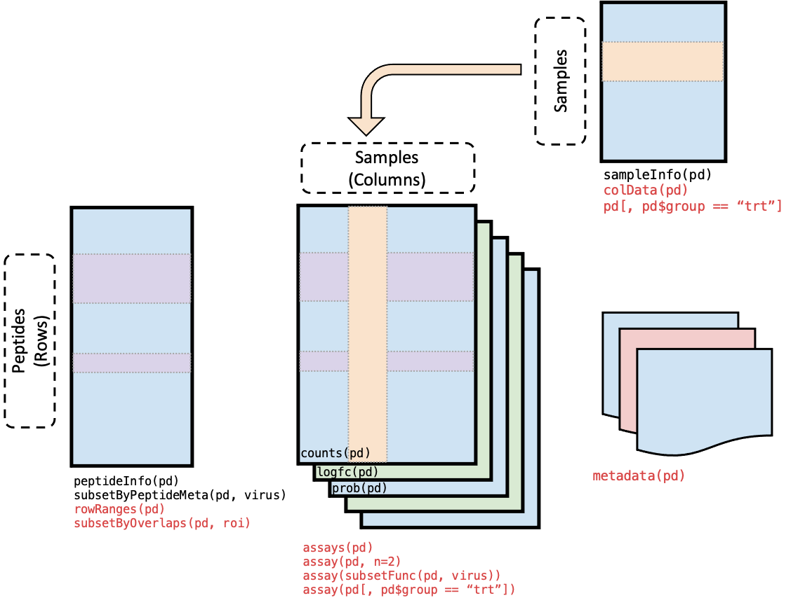

```{r, include = FALSE}
knitr::opts_chunk$set(
  comment = "##"
)
```

# Installation

We recommend installing the stable release version of `PhIPData` in Bioconductor.
This can be done using `BiocManager`:

```{r, eval = FALSE}
if (!require("BiocManager"))
    install.packages("BiocManager")
    
BiocManager::install("PhIPData")
```

To load the package:

```{r, include = TRUE, results = "hide", message = FALSE, warning = FALSE}
library(PhIPData)
```

# Introduction

The `PhIPData` class is used to store experimental results from phage-immunoprecipitation sequencing (PhIP-set) experiments in a matrix-like container.

Building on the [`RangedSummarizedExperiment`](https://bioconductor.org/packages/release/bioc/html/SummarizedExperiment.html) class, `PhIPData` contains all of functionality of `SummarizedExperiments` and includes additional operations to facilitate analysis with PhIP-seq data. Like `SummarizedExperiments`, a key feature of `PhIPData` is the coordination of metadata when subsetting `PhIPData` objects. For example, if you wanted to examine experimental data for peptides from one particular virus, you can subset the experimental data and the associated peptide annotation with one command. This ensures all metadata (for samples, peptides, etc.) remain synced with the experimental data throughout analysis. 

# Components of a `PhIPData` Object

As reflected in the figure below, the structure of a `PhIPData` object is nearly identical to the structure of a `SummarizedExperiment`/`RangedSummarizedExperiment` object. 

Each object contains at least three assays of data. These assays are:

* `counts`: matrix of raw read counts,
* `logfc`: matrix of log2 estimated fold-changes (in comparison to negative control samples),
* `prob`: matrix of probabilities (p-values or posterior probabilities) associated with whether a sample shows an enriched antibody response to the particular peptide. 

Though `counts` typically contain integer values for the number of reads aligned to each peptide, `PhIPData` only requires that stored values are non-negative numeric values. Pseudocounts or non-integer count values can also be stored in the `counts` assay.

The rows of a `PhIPData` object represent peptides of interest and the columns represent samples. Sample and peptide metadata are stored in `DataFrame`s. Each row of the metadata `DataFrame` specifies the peptide/sample, and the columns represent different features associated with the peptides/samples. 

In addition to sample- and peptide-specific metadata, experimental metadata such as associated papers, experimental parameters, sequencing dates, etc. are stored in a list-like component named `metadata`. 

```{r, echo = FALSE, fig.cap = "Schematic of a PhIPData object. Commands used to access each component of the object are listed underneath its visual representation. Code in black indicates functions specific to `PhIPData` objects while functions in red extend `SummarizedExperiment` functions. Here, `pd` is a generic `PhIPData` object.", out.width = "\\maxwidth"}

```

# Creating a `PhIPData` object

```{r setup, warning = FALSE, message = FALSE}
library(dplyr)
library(readr)
```

To demonstrate the `PhIPData` class and functions, we will use a simulated example data set. Suppose we have PhIP-seq data from 5 individuals for 1288 peptides derived from known human viruses. 

```{r}
set.seed(20210120)

# Read in peptide metadata -------------
virscan_file <- system.file("extdata", "virscan.tsv", package = "PhIPData")
virscan_info <- readr::read_tsv(virscan_file,
                                col_types = readr::cols(
                                  pep_id = readr::col_character(),
                                  pro_id = readr::col_character(),
                                  pos_start = readr::col_double(),
                                  pos_end = readr::col_double(),
                                  UniProt_acc = readr::col_character(),
                                  pep_dna = readr::col_character(),
                                  pep_aa = readr::col_character(),
                                  pro_len = readr::col_double(),
                                  taxon_id = readr::col_double(),
                                  species = readr::col_character(),
                                  genus = readr::col_character(),
                                  product = readr::col_character()
                                )) %>%
  as.data.frame()

# Simulate data -------------
n_samples <- 5L
n_peps <- nrow(virscan_info)

counts_dat <- matrix(sample(1:1e6, n_samples*n_peps, replace = TRUE),
                 nrow = n_peps)
logfc_dat <- matrix(rnorm(n_samples*n_peps, mean = 0, sd = 10), 
                    nrow = n_peps)
prob_dat <- matrix(rbeta(n_samples*n_peps, shape1 = 1, shape2 = 1), 
                   nrow = n_peps)

# Sample metadata -------------
sample_meta <- data.frame(sample_name = paste0("sample", 1:n_samples),
                          gender = sample(c("M", "F"), n_samples, TRUE),
                          group = sample(c("ctrl", "trt", "beads"), n_samples, TRUE))

# Set row/column names -------------
rownames(counts_dat) <- rownames(logfc_dat) <-
  rownames(prob_dat) <- rownames(virscan_info) <-
  paste0("pep_", 1:n_peps)

colnames(counts_dat) <- colnames(logfc_dat) <-
  colnames(prob_dat) <- rownames(sample_meta) <-
  paste0("sample_", 1:n_samples)

# Experimental metadata -------------
exp_meta <- list(date_run = as.Date("2021/01/20"), 
                 reads_per_sample = colSums(counts_dat))
```

To create a `PhIPData` object, we will use the homonymous constructor `PhIPData()`.

```{r}
phip_obj <- PhIPData(counts_dat, logfc_dat, prob_dat, 
                     virscan_info, sample_meta, 
                     exp_meta)

phip_obj
```

The `PhIPData()` constructor is quite flexible; mismatched dimension names across assays and metadata are automatically corrected, and missing assays are initialized with empty matrices of the same dimensions. For more details on the constructor, type `help(PhIPData)`. 

# Accessing and modifying components of `PhIPData` object

## Assays

Assays store matrix-like data. For `PhIPData` objects, the assays `counts`, `logfc`, and `prob` are required. If any of these matrices were missing from the constructor, they are initialized with empty matrices of the same dimensions. Experimental data can be accessed via `assays(phip_obj)` or `assay(phip_obj, i)` command. `assays(phip_obj)` returns a list of all assays in the object, and list items can be accessed using the `$` or `[[` operators.

```{r}
assays(phip_obj)

head(assays(phip_obj)$counts)   # Returns the same as assays(phip_obj)[["counts"]]
```

While `assays(phip_obj)` returns a list of all assays in the `PhIPData` object, `assay(phip_obj, i)` returns a `matrix` of the specified assay. If `i` is missing, `assay(phip_obj)` defaults to the first assay (`counts`). `i` can be a character specifying the assay name or a numeric index of the assay.

```{r}
head(assay(phip_obj, "logfc"))   # Returns the same as assay(phip_obj, 2)
```

Since all `PhIPData` objects must contain the `counts`, `logfc`, and `prob` assays, we have defined three homonyous function to conveniently access and modify these assays.

```{r}
head(counts(phip_obj))
head(logfc(phip_obj))
head(prob(phip_obj))
```

After a `PhIPData` object has been created, data for new and existing assays can be set using `<-`. Dimension names of the replacement assays are automatically corrected to be identical to the object names. As we expect assays to contain homogenous data, replacement assays are coerced into matrices. Replacement assays must also be on the same dimension of the existing object.


```{r, error = T}
replacement_dat <- matrix(1, nrow = n_peps, ncol = n_samples)

# Replace the counts matrix -------------
head(counts(phip_obj))
counts(phip_obj) <- replacement_dat
head(counts(phip_obj))

# Add a new assay -----------
head(assay(phip_obj, "new_assay"))
assay(phip_obj, "new_assay") <- replacement_dat
head(assay(phip_obj, "new_assay"))

# Returns and error because `counts`, `logfc`, and `prob` must be in the 
# assays of a PhIPData object
assays(phip_obj) <- list(new_assay1 = replacement_dat, 
                         new_assay2 = replacement_dat)
```

## Peptide metadata

Information associated with peptides can be accessed using `peptideInfo(phip_obj)` or the inherited `rowRanges(phip_obj)` function. Both functions return a `GRanges` object. `GRanges` objects behave similar to matrices and can be subsetted using the usual 2-dimensional methods. More information about `GRanges` objects can be found [here](http://bioconductor.org/packages/release/bioc/html/GenomicRanges.html). 

Information about peptide positions in the protein sequence are stored as `IRanges` in the `GRanges` object. These are specified by `pos_start` and `pos_end` columns in the peptide metadata in the constructor. If these columns do not exist, the start and end positions are set to 0 by default. 

```{r}
# Only showing 2 columns for easier viewing
peptideInfo(phip_obj)[, 8:9]
```

## Sample metadata

Sample metadata describing the samples can be extracted from the `PhIPData` object using `sampleInfo(phip_obj)` or the inherited function `colData(phip_obj)`. Both functions return a `DataFrame` where each row corresponds to a sample and each column corresponds to some sample description. 

```{r}
sampleInfo(phip_obj)
```

Like in `SummarizedExperiments`/`RangedSummarizedExperiments`, sample metadata can be accessed using the `$` operator from the object. As demonstrated in the [Subsetting](#subsetting) section, this makes subetting data for a subgroup of samples very easy. 

```{r}
phip_obj$group
```

## Experimental metadata

Data associated with the experiment such as papers, date the samples were run, etc. can be accessed via the `metadata(phip_obj)` function. Experimental metadata is stored as a list, so it can be used to store *any* type of data. 

```{r}
metadata(phip_obj)
```

# Common operations on `PhIPData` objects

## Subsetting 

Like subsetting matrices and dataframes, `[` can be used for two-dimensional subsetting of `PhIPData` objects.

```{r}
phip_obj[1:10, 1:2]
```

As described in the [Sample metadata](#sample-metadata) section, `$` operates on the sample metadata column names, so we can also use `$` to select samples of a particular subgroups. 

```{r}
phip_obj[, phip_obj$group == "beads"]
```

In addition to subsetting by row indices, `PhIPData` supports subsetting rows using peptide metadata information. `subset(phip_obj, row_condition, column_condition)` returns a `PhIPData` object with rows where the specified condition holds. 

```{r}
ebv_sub <- subset(phip_obj, grepl("Epstein-Barr virus", species))

peptideInfo(ebv_sub)[, "species"]
```

To subset all beads-only samples from a `PhIPData` object, we can use the convenient wrapper function `subsetBeads()`:

```{r}
subsetBeads(phip_obj)
```

## `PhIPData` summaries

To assess the quality of the data, we are often interested in the number of reads per sample. This can be done using the `librarySize()` function. Names can be removed by setting the `withDimnames` parameter to `FALSE`. 

```{r}
librarySize(phip_obj)
```

The proportion of sample reads pulled by each peptide can also be obtained via `propReads()`. Like `librarySize()`, names can also be removed by setting `withDimnames` to `FALSE`. 

```{r}
head(propReads(phip_obj))
```

## Using template libraries

Rather than re-importing peptide annotations, `PhIPData` allows the user to create and reuse existing libraries. By default, libraries are stored in the `libraries` folder of the `PhIPData` package. The library path can be set using `setLibraryPath(new_path)`. Once set, the new path is stored in the `PHIP_LIBRARY_PATH` `R` environment variable. The current library path can be viewed with `getLibraryPath()`.  


```{r}
getLibraryPath()
```

To save a library for future use, we can use `makeLibrary(object, name_of_library)`. The peptide metadata should be in a matrix-like form such as a `DataFrame` or `data.frame`. 

```{r}
# Save virscan_info as the human_virus library
makeLibrary(virscan_info, "human_virus")
```

The stored library can be accessed using `getLibrary(library_name)`. We can then use the stored library to construct a new `PhIPData` object as follows. 

```{r}
PhIPData(counts = counts_dat, 
         sampleInfo = sample_meta,
         peptideInfo = getLibrary("human_virus"))
```

```{r, echo = FALSE, results = "hide"}
# clean-up test space
file.remove(paste0(getLibraryPath(), "/human_virus.rds"))
```

## Using aliases

Peptides are often derived from species with long virus names. To quickly search up all viruses with "[Hh]uman immunodeficiency virus" in the species, you can create an alias of "HIV" to encode for the corresponding regex of interest. Alias's can be managed with:

* `getAlias(key)`: return the regex for the alias `key`. 
* `setAlias(key, pattern)`: create or modify the alias for `key`. If the key-pattern combination already exists in the database, then no changes are made. Otherwise, the pattern is replaced with `pattern`.
* `deleteAlias(key)`: remove an key-pattern combination from the alias database. 

```{r, error = T}
# Create alias for HIV ----------
setAlias("hiv", "[Hh]uman immunodeficiency virus")

# Use alias ----------
hiv_sub <- subset(phip_obj, grepl(getAlias("hiv"), species))
peptideInfo(hiv_sub)[, "species"]

# Remove alias from database -----------
deleteAlias("hiv")

# The following command returns an error that the virus does
# not exist in the alias database. 
subset(phip_obj, grepl(getAlias("hiv"), species))
```

Alias-pattern combinations are case senstive, so an entry with key "hiv" would differ from an entry with key "HIV." Like libraries, by default the location of the alias database is in the `extdata` folder of the `PhIPData` package. The location to an .rda file with the key-pattern values in a dataframe called alias can be retreived and specified using the `getAliasPath()` and `setAliasPath()` functions, respectively. 

## Coercion from `PhIPData` to other containers

As packages for identifying differential experession are also commonly used in analyzing PhIP-seq data, the `PhIPData` package supports coercion from `PhIPData` objects to `Lists`, `lists`, and `DGELists`. The function `as(phip_obj, "object_type")` converts a `PhIPData` object to a object of `object type`. 

For `DGELists`, the `group` slot is automatically populated with the `group` column in the sample metadata, if such a column exists. 

```{r}
# PhIPData to DGEList
as(phip_obj, "DGEList")
```

# `sessionInfo()`

```{r}
sessionInfo()
```
